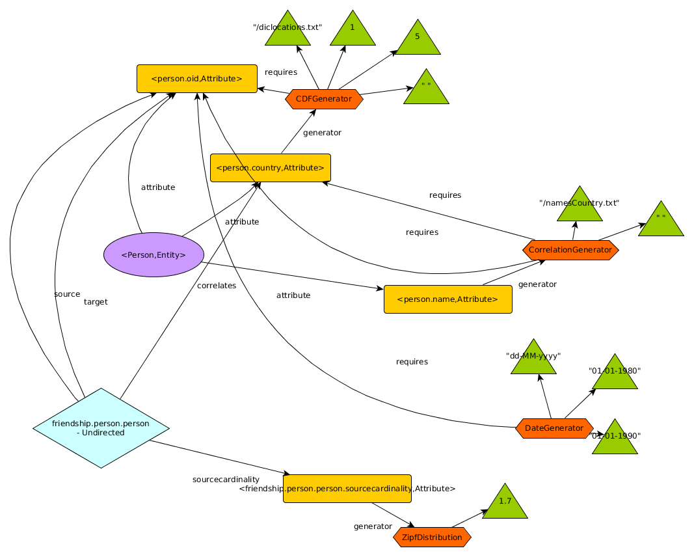

# DataSynth

DataSynth (standing from Data Synthetizer) is a framework for the creation of
data generators. More concretely, and compared to other tools in the state of
the art, DataSynth departs from the classical relational model and aims at
producing property graphs.

DataSynth receives a query in a DSL (currently a plain json file), specifying
the schema of the property graph to generate including entities (nodes), edges and
attributes, how the values of different attributes are generated, etc.

Currently, DataSynth supports the generation of the following items:
* Nodes
* Undirected edges between the same entity

The following is an example schema specified in json, to create 10000 instances
of a single entity named "person" with attributes country and name of type "String", and
an undirected edge named "friendship" connecting persons whose name an country
are correlated, and with a Zipf degree distribution.

```
{
  "entities" : [
    {
      "name" : "person",
      "number" : 10000,
      "attributes" : [
        {
          "name" : "country",
          "type" : "String",
          "generator" : {
            "name" : "org.dama.datasynth.generators.CDFGenerator",
            "requires" : [],
            "init" : ["/dicLocations.txt",1,5," "]
          }
        },
        {
          "name" : "name",
          "type" : "String",
          "generator" : {
            "name" : "org.dama.datasynth.generators.CorrellationGenerator",
            "requires" : ["person.country"],
            "init" : ["/namesByCountry.txt"," "]
          }
        }
      ]
    }
  ],
  "edges" : [
  {
    "name" : "friendship",
    "direction" : "undirected",
    "source" : "person",
    "target" : "person",
    "sourceCardinality" : {
      "generator" : {
        "name" :
          "org.dama.datasynth.generators.ZipfDistribution",
        "requires"
          : [],
          "init"
            :
            [1.7]
      }
    },
    "correlates"
      :
      ["person.country","person.name"]
  }
  ]
}
```

## Generators

One of the most important elements in DataSynth are generators. A Generator is a
class that representing some sort of "functor" (a callable object). This object
is used to generate the values of a given type, for instance, for a particular attribute. For instance, the
"country" attribute values for the persons is created using the
"org.dama.datasynth.generators.CDFGenerator" generator, wich basically generates
values from a dictionary, containing the values and a cummulative distribution
function. A Generator implements two methods: "initialize", and "run". The
method "initialize", is called onece and as its name indicates is used to
initialize the generator.  The method "initialize" receives the set of
parameters via the "init" list, which in the case of the "country" attribute are
the dicLocations.txt file (this file is included in the repository for example
 purposes), the columns indexes containing the values and the probabilities, and
the separator. The method "initialize" signature must match the types of the
literals passed in the init list. For instance, in the case of the CDFGenerator,
this signature must be:

````
public void initialize(String file, Long x, Long y, String sep );
````

For simplicity, the currently supported types for parameters are String, Long,
boolean and Double.

The run method, on the other hand, is what generates the attribute values, and
is called as many times as there are attribute values to generate. Compared to
"initialize", the run method accepts references to other attributes, which can
be used to generate correlated values within entity attributes. For instance,
attribute "name" generator requires the
person.country attribute. This means that the generator CorrelationGenerator
(which is a generator that takes a file containing pairs of valueA-valueB, in
 this case country-name), will receive a String value in its run method with the
country attribute. This way, the name of the person can depend on the actual
country this person is from.  In this particular case, the run method signature
should be:

````
public String run(Long id, String country);
````

Note that the first parameter is a Long, which is used to pass the internal oid
of the particular entity instance this attribute is generated for. Internal oids
are used to identify particular instances and are unique, and they are
automatically greated by the framework as an additional attribute. Also, the
return type of the run method must match the type of the attribute being
generated.

Generators are also used to control the cardinality of edges. In the example,
the undirected friendship edge, has a source cardinality generated to follow a
Zipf distribution. Edge cardinalities are internally treated as attributes, thus
they can also reference other attributes of the entity to be generated. For
instance, imagine we want to make persons of some specific countries more active
in the dataset and thus have more connections with other persons.

To sum up, generators are just like function objects that are executed (mapped) over
a collection of elements, and for each element they produce a result using their run function.

Finally, we can specify correlations between entities connected by an edge. This
means, that there will be a larger probability that those persons with similar
attributes are connected. Currently, the way edges are generated is very
monolithic, but this will be extended in the future and I'll show you how this
can be done. In this case, persons from the same country are more likely to be
connected.

## Block Generators

Regular generators take a particular set of parameters and produce a single result.
There exists another type of generator that work on a set of elements and produce another
set of elements. These generators are used, for instance, to generate edges. 
In the example above, although it is not especified in the schema, we use an 
UndirectedEdgeGenerator block generator over blocks of persons to create the edges. 
So far, it is only important that you know that there are two types of generators,
the single-element generator and the block generator. This will let you understand what
comes now.

## The dependency property graph

Given a query, the framework generates a property graph representation of the
query, which is basically a graph of dependencies between elements to be
generated. The following is the dependency graph of the above query:



The dependency graph is used within the framework to query the details of the schema to generate, 
and used to produce the data generation tasks that will actually generate the desired data. 
Actually, what the framework does is to produce a program in an intermediate representation 
custom language called Schnappi.

### Custom data generation tasks using Schnappi

Data in real world is very diverse, not only in terms of their schema but also in terms of their
characteristics. Thus, every use case can have different needs, so having a program able to generate
all kinds of data with all kinds of characteristics is simply impossible. 

In order to allow the DataSynth framework to evolve in a scalable way, and to allow people to customize
the data generation process according to their specific needs by using a custom scripting language called Schnappi.
The goal of Schnappi is three-fold:
* To be very simple and constrained in terms of the operators and operands. Since ideally we want to generate large amounts of data, we need an interface to express the programs in a scalable way. Thus, operators in Schnappi are parallel operators or operators that can be implemented in parallel efficiently (such as map, mappart, union, sort ..). On the other hand, operands are tables and generators.
* To abstract the backedn from the front-end. Thus, anyone can implement the backend using the desired technology, he just needs to interpres Schnappi or generate executable code out of it.
* Allow backends to perform additional optimizations. By passing the full program to the backends, these can analyze it and perform additional optimizations based on their characteristics. 

So basically, given a schema specified using the json, DataSynth produces Schnappi code that can then be executed. The following is the generated code for the above example. As you can see, only functions sort, mappart, map and union are used, as well as init which is used to initialize a generator. As we will see in a moment, we allow users to hook into the code generation in order to customize how data is generated, but before let's have a quick look at the Schnappi language.

```
person.oid = genids(10000);
f = init('org.dama.datasynth.generators.CDFGenerator', '/dicLocations.txt', 1, 5,' '); 
rparams = union(person.oid);
person.country = map(f,rparams);

f = init('org.dama.datasynth.generators.CorrellationGenerator','/namesByCountry.txt', ' '); 
rparams = union(person.oid, person.country);
person.name = map(f,rparams);

f = init('org.dama.datasynth.generators.ZipfDistribution',1.7);
rparams = union(person.oid);
friendship.person.person.sourcecardinality = map(f,rparams);

hgen = init('org.dama.datasynth.generators.HashCombiner');
hdep = union(person.oid,person.country);
hattr = map(hgen,hdep);
table = union(person.oid, hattr, friendship.person.person.sourcecardinality);
sorted = sort(table,1);
edgegenerator = init('org.dama.datasynth.generators.edgegenerators.UndirectedEdgeGenerator');

friendship.person.person = mappart(edgegenerator,sorted);
```

The basic operads in Schnappi are tables of the form <id,attr1,attr2,...> and generator objects. The complex data generation processes must go inside generators, which are then applied to tables in parallel using map and mappart functions. 

### init( g : String, args : T ...)

Returns an instance of the generator with name g initialized with args. Note that the type of the arguments is undetermined, and type-checking is evaluated by the frontend at runtime. 

### map( generator : Generator, t : Table)

Returns a Table <id : Long, val : T> resuling of mapping the generator to each element of t. The frontend checks that the types of the generator run function match those of the columns of t. 

### mappart( generator : Generator, t : Table)

Returns a new Table <id : Long, val : T> resuling of mapping the generator to each partition of t. The frontend checks that the types of the generator run function match those of the columns of t. Currently, the number of partitions of a table is implementation defined. 

### union( tables : Table ...)

Returns a new table <id, val1 : T, val2 : T, ..., valn : T> by zipping the input tables. Input tables must be sorted by id. This is like performing a join between on the id of all the input tables.

### sort( t : Table, i : Long ...) 

Returns a copy of the table t sorted in ascending order on the columns specified by i.

## Contributing

Feel free to contribute to the project by issuing pull requests, suggestions
etc. A Trello board with the current pending and in-dev tasks can be found here:

https://trello.com/b/AEZ99vTz/datasynth
